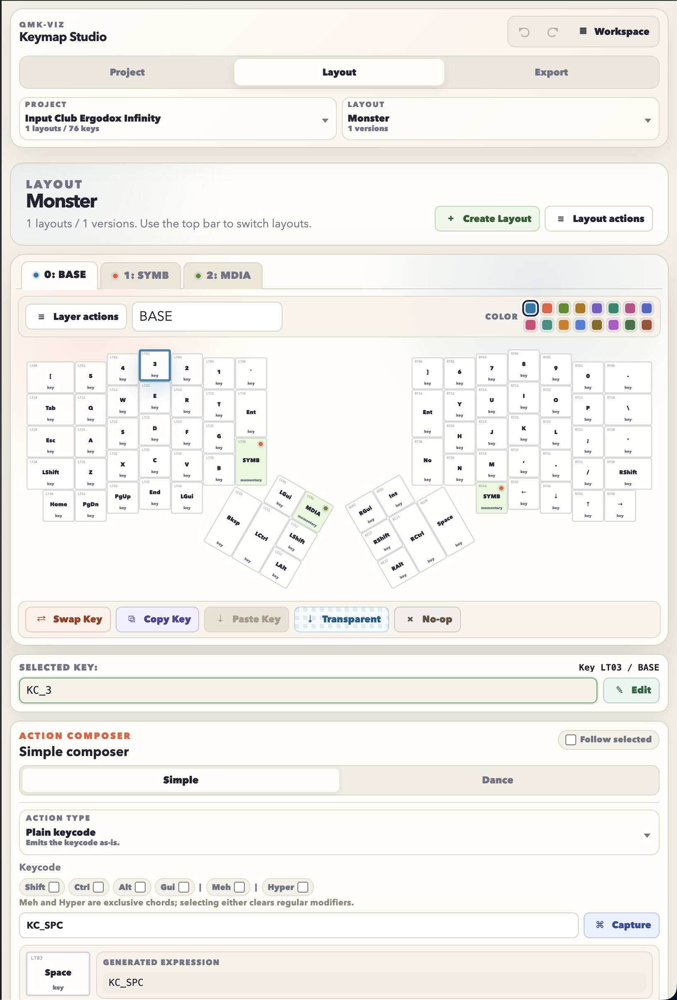

# qmk-viz

Visual JSON keymap editor for QMK keyboards.

qmk-viz is a local-first web app for designing keyboard layouts from a Keyboard Layout Editor model, editing key actions visually, and exporting structured JSON or rendered `keymap.c` templates. It is built for people who want Oryx-style layout editing without being tied to a specific keyboard vendor or firmware service.

[Open qmk-viz](https://nonlogicaldev.github.io/tool.qmk-viz/)



## Why Use It

- **Bring your own keyboard model.** Upload Keyboard Layout Editor JSON and qmk-viz derives the key positions and stable key IDs from it.
- **Edit visually.** Click keys, swap mappings, copy/paste keys, mark transparent/no-op actions, and compose common QMK expressions without hand-editing every slot.
- **Compose actions without memorizing QMK.** Build plain keycodes, modifier stacks, mod-taps, layer-taps, layer switches, dances, aliases, macros, and raw expressions from the interface.
- **Keep layout history.** Save named immutable layout versions, fork from older versions, and see the version tree.
- **Export real project data.** Download a full project backup with KLE plus layouts, or export a single layout JSON for templating.
- **Generate firmware source your way.** Use the built-in keymap template renderer, or bring your own generator and feed it the exported layout JSON.
- **No account, no server.** The published app is static and stores user projects in `localStorage`.

## How The Model Works

qmk-viz treats the KLE file as the source of truth for physical key placement. Each editable key needs one stable identifier in the center legend entry, such as `K00`, `LT03`, `RT21`, `LC12`, or `RC22`.

When the KLE model changes later, qmk-viz reconciles layouts by identifier:

- Matching IDs keep their mappings.
- New IDs start transparent.
- Removed IDs disappear from future exports.

This keeps the keyboard geometry editable without baking board-specific dimensions or matrix tables into the app.

## Full Interface Action Composer

The Layout page is meant to be usable even when you do not remember the exact QMK spelling for every expression.

The Action Composer can generate common QMK mappings from structured fields:

- Plain keycodes with modifier checkboxes, including terse key display such as `Gui+Shift+5`.
- Hold/tap actions such as `MT(MOD_LCTL, KC_ESC)` and `LT(NAVI, KC_SPC)`.
- Layer actions such as `MO(NAVI)`, `TG(SYMB)`, `TT(FN)`, `TO(BASE)`, and `DF(BASE)`.
- Key dances with tap, hold, double-tap, and tap-then-hold slots.
- Custom key aliases, custom keycodes, and macros that can be reused in mappings and templates.
- Raw QMK expressions when you want the full power escape hatch.

The selected key preview updates with the generated expression before you apply it, and the editor keeps keyboard-level operations nearby: swap two keys by drag/drop, copy/paste a key mapping, or set a key to transparent/no-op from the toolbelt.

## Project Flow

1. Create a project.
2. Upload or paste a KLE JSON keyboard model.
3. Create a layout or import a layout JSON file.
4. Edit keys visually in the Layout page.
5. Save layout versions as checkpoints.
6. Export a rendered `keymap.c`, feed the layout JSON into your own generator, or download a project backup, project KLE, or layer KLE.

Starter examples live in `default-projects/` as complete `qmk-viz-project` JSON files. They are loaded as examples, not mixed into user projects.

## What It Exports

- **Layout JSON:** active layout only. This is the clean data shape for custom generators, scripts, or external templates.
- **Rendered keymap:** generated inside qmk-viz from the project template with layout JSON passed as `ctx`.
- **Full Project:** KLE model, all named layouts, version history, support tables, and template.
- **Project KLE:** canonical KLE model with qmk-viz identifiers embedded.
- **Layer KLE:** active-layer KLE preview with current QMK expressions written onto the keys.
- **Workspace Backup:** all user projects stored in browser local storage.

## Custom `keymap.c` Templates

qmk-viz supports two firmware-generation paths:

- Use the built-in Nunjucks template renderer on the Export page to preview, copy, and download a generated `keymap.c`.
- Download the layout JSON and feed it into your own generator, script, or build pipeline.

Each project can store a Nunjucks template for generating firmware source. The template receives the same layout JSON that you can download from the Export page as `ctx`, so rendering is reproducible outside the app with a normal Nunjucks renderer.

A minimal template can iterate every layer and emit a generic QMK layout:

```c
#include QMK_KEYBOARD_H

enum layer_names {

    {{ layer.name }},

};

const uint16_t PROGMEM keymaps[][MATRIX_ROWS][MATRIX_COLS] = {

    [{{ layer.name }}] = LAYOUT(

        {{ code }}, // {{ slot }}

    ),

};
```

For real keyboards, you usually define a tiny helper macro and place slots in the exact order your QMK layout macro expects:

```c
{{ layer.keys[slot] or "KC_TRNS" }}

const uint16_t PROGMEM keymaps[][MATRIX_ROWS][MATRIX_COLS] = {

    [{{ layer.name }}] = LAYOUT_ortho_4x12(
        {{ K(layer, "K00") }}, {{ K(layer, "K01") }}, {{ K(layer, "K02") }},
        {{ K(layer, "K10") }}, {{ K(layer, "K11") }}, {{ K(layer, "K12") }}
    ),

};
```

Templates can also emit support code from the layout support tables:

```c

#define {{ key.name }} {{ key.value }}


enum custom_keycodes {

    {{ key.name }} = SAFE_RANGE,

};

bool process_record_user(uint16_t keycode, keyrecord_t *record) {

    if (keycode == {{ macro.name }} && record->event.pressed) {
        {{ macro.value }};
        return false;
    }

    return true;
}
```

That means a project can hold both the visual layout and the exact source-generation strategy for a specific QMK keyboard, while individual layouts stay clean JSON data.

## Local Development

Install dependencies and start the Vite dev server:

```bash
just dev
```

Build the static app:

```bash
just build
```

Build for the GitHub Pages project URL:

```bash
npm run build:pages
```

Preview the production build:

```bash
just preview
```

Deployments run from `.github/workflows/pages.yml` on every `master` push.

## Tech Stack

- React 19
- TypeScript
- Vite
- Zustand
- TanStack Router with hash routing
- Monaco Editor
- Nunjucks templates
- XYFlow version trees
- Sonner toasts

## License

MIT
